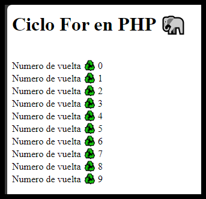

# 13.- Ciclo Do-While en PHP🐘

<details>  <summary><h3> ¿Qué hace este programa? 🤔</h3> </summary>

## Ciclo For en PHP

En PHP, el ciclo for es una estructura de control que nos permite ejecutar un bloque de código repetidamente, un número específico de veces. Es ideal cuando sabemos exactamente cuántas veces queremos repetir una acción.

### Funcionamiento

El código proporcionado es un ejemplo de uso del ciclo for en PHP para imprimir una secuencia de números del 0 al 9.

1. **Inicialización:**
   - Se inicializa una variable `$numeroInicial` con el valor 0, que será el valor inicial del contador del ciclo.

2. **Condición de Terminación:**
   - Se establece una condición de terminación del ciclo, en este caso, `$numeroInicial < 10`. Mientras esta condición sea verdadera, el ciclo continuará ejecutándose.

3. **Incremento:**
   - Después de cada iteración del ciclo, la variable `$numeroInicial` se incrementa en 1 (`$numeroInicial++`).

4. **Bloque de Código:**
   - Dentro del ciclo for, se ejecuta un bloque de código que imprime el número de vuelta actual (`$numeroInicial`).



</details>

## Information 🗂

- Title:  `Ciclo Do-While en PHP 🐘`
- Recreación de código por:
  - `Jorge A. Fuentes Jiménez` 👨‍💻 [@Lechu-Dev](https://github.com/LechugasJorge)

## Install & Dependence

- [](https://httpd.apache.org/)
- [](https://www.php.net/)
- [](https://code.visualstudio.com/)

<details>
  <summary>
  <h2> Código 👨‍💻 </h2>
  </summary>

```php
<?php
echo "<h1>Ciclo For en PHP 🐘</h1>";
for($numeroInicial=0;$numeroInicial<10;$numeroInicial++){
    echo "<br>Numero de vuelta ♻ ".$numeroInicial;
}
?>
```

Se puede copiar y pegar

</details>
<details>
  <summary>

## Uso

  ¡Experimenta con el código y aprende!

</summary>

1. Descarga y guarda el código PHP en un archivo con extensión `.php`, por ejemplo, `mi_pagina.php`.

2. Coloca este archivo en el directorio raíz de tu servidor web local (por ejemplo, en la carpeta `htdocs` si estás utilizando Apache).

3. Abre un navegador web y navega a la dirección donde has alojado el archivo, por ejemplo, `http://localhost/mi_pagina.php`.

4. Verás la página web generada por el script PHP, que incluirá un título, un subtítulo y un párrafo con mensajes estáticos.

5. ¡Experimenta modificando el código PHP y observa cómo afecta el resultado en la página web!

</details>

## 🟢 Jerarquía de Directorios


## Mi Equipo de Computo 🖥

- Software 👾

  ```txt
  OS: Windows 10 Pro for Workstations
  Sistema operativo de 64 bits
  PHP: PHP 8.2.12 (cli)
  Server version: Apache/2.4.58 (Win64)
  ```

- Hardware 🖥

```txt
  CPU: Intel(R) Core(TM) i3-7100U CPU @ 2.40GHz   2.40 GHz
  GPU: Intel(R) HD Graphics 620
```

## References

Obtenido de;

`CURSO php desde cero`

 [](https://www.youtube.com/watch?v=nCB1gEkRZ1g)

Muchas Gracias al canal

- [@Develoteca - Oscar Uh](https://www.youtube.com/@Develoteca)

<!-- Redes Sociales -->
<h2 align="center">Conécta conmigo</h2>
<p align="center">
  <a href="https://www.linkedin.com/in/jorgelechugas/">
    </a>
<!-- Twitter -->
<a href="https://twitter.com/Lechu_Dev">
  </a>
  <!-- Twitch -->
  <a href="https://www.twitch.tv/lechugaslettuches">
    
  </a>
</p><p align="center">
  <!-- YouTube -->
  <a href="https://www.youtube.com/channel/UCCVH3mvZFNs9vZQP_3PL_jw">
    
  </a>
<a href="https://www.youtube.com/channel/UCA-UArQPMiba7YgPw7OsgHg">
    
  </a>
</p><p align="center">
<!-- GitHub -->
<a href="https://github.com/usuario">
  
</a>
  <!-- Facebook -->
  <a href="https://www.facebook.com/profile.php?id=61550480867105">
    
  </a>
  <!-- Instagram -->
  <a href="https://www.instagram.com/lechugasskate/">
    
  </a>

</p>
<style>
  /* Estilos para la animación */
  details {
    background-color: #222222;
    padding: 10px;
    border: 1px solid #454545;
    border-radius: 5px;
    margin-bottom: 10px;
    overflow: hidden;
    transition: max-height 0.3s ease-out;
  }
  summary {
    cursor: pointer;
    user-select: none; /* Evitar la selección de texto */
    transition: color 0.3s ease-out;
  }
  summary:hover {
    color: #007bff; /* Cambiar color al pasar el mouse */
  }
</style>
