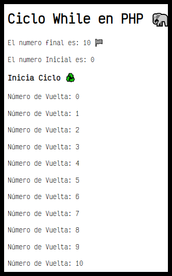

# 13.- Ciclo While en PHP🐘

<details>  <summary><h3> ¿Qué hace este programa? 🤔</h3> </summary>

## Ciclo While ♻ en PHP

### Descripción del Ciclo While en PHP

El ciclo `while` en PHP funciona de la siguiente manera:

1. **Evaluación de la Condición**:
   - Se evalúa una condición booleana.

2. **Ejecución del Bloque de Código**:
   - Si la condición es verdadera, se ejecuta el bloque de código asociado al `while`.

3. **Reevaluación de la Condición**:
   - Después de ejecutar el bloque de código, se vuelve a evaluar la condición.

4. **Repetición del Ciclo**:
   - Si la condición sigue siendo verdadera, el ciclo se repite y el bloque de código se ejecuta nuevamente.

5. **Finalización del Ciclo**:
   - Este proceso se repite hasta que la condición se vuelva falsa. En ese momento, el ciclo `while` se detiene y la ejecución del programa continúa con el código que sigue después del bloque `while`.

El ciclo `while` en PHP se utiliza para repetir un bloque de código mientras una condición sea verdadera. Es importante tener cuidado de que la condición pueda volverse falsa en algún momento para evitar bucles infinitos. 🔄👨‍💻



</details>

## Information 🗂

- Title:  `Ciclo While en PHP 🐘`
- Recreación de código por:
  - `Jorge A. Fuentes Jiménez` 👨‍💻 [@Lechu-Dev](https://github.com/LechugasJorge)

## Install & Dependence

- [](https://httpd.apache.org/)
- [](https://www.php.net/)
- [](https://code.visualstudio.com/)

<details>
  <summary>
  <h2> Código 👨‍💻 </h2>
  </summary>

```php
<?php
echo "<h1>Ciclo While en PHP 🐘</h1>";
$numeroinicial=0;
$numerolimite=10;
echo "<p>El numero final es: $numerolimite 🏁</p>
    <p>El numero Inicial es: $numeroinicial</p><h3>Inicia Ciclo ♻</h3>";
    while($numeroinicial<=$numerolimite){
    echo "<p>Número de Vuelta: $numeroinicial</p>";
    $numeroinicial++;//Incremento dentro del ciclo while
};
?>

```

Se puede copiar y pegar

</details>
<details>
  <summary>

## Uso

  ¡Experimenta con el código y aprende!

</summary>

1. Descarga y guarda el código PHP en un archivo con extensión `.php`, por ejemplo, `mi_pagina.php`.

2. Coloca este archivo en el directorio raíz de tu servidor web local (por ejemplo, en la carpeta `htdocs` si estás utilizando Apache).

3. Abre un navegador web y navega a la dirección donde has alojado el archivo, por ejemplo, `http://localhost/mi_pagina.php`.

4. Verás la página web generada por el script PHP, que incluirá un título, un subtítulo y un párrafo con mensajes estáticos.

5. ¡Experimenta modificando el código PHP y observa cómo afecta el resultado en la página web!

</details>

## 🟢 Jerarquía de Directorios


## Mi Equipo de Computo 🖥

- Software 👾

  ```txt
  OS: Windows 10 Pro for Workstations
  Sistema operativo de 64 bits
  PHP: PHP 8.2.12 (cli)
  Server version: Apache/2.4.58 (Win64)
  ```

- Hardware 🖥

```txt
  CPU: Intel(R) Core(TM) i3-7100U CPU @ 2.40GHz   2.40 GHz
  GPU: Intel(R) HD Graphics 620
```

## References

Obtenido de;

`CURSO php desde cero`

 [](https://www.youtube.com/watch?v=nCB1gEkRZ1g)

Muchas Gracias al canal

- [@Develoteca - Oscar Uh](https://www.youtube.com/@Develoteca)

<!-- Redes Sociales -->
<h2 align="center">Conécta conmigo</h2>
<p align="center">
  <a href="https://www.linkedin.com/in/jorgelechugas/">
    </a>
<!-- Twitter -->
<a href="https://twitter.com/Lechu_Dev">
  </a>
  <!-- Twitch -->
  <a href="https://www.twitch.tv/lechugaslettuches">
    
  </a>
</p><p align="center">
  <!-- YouTube -->
  <a href="https://www.youtube.com/channel/UCCVH3mvZFNs9vZQP_3PL_jw">
    
  </a>
<a href="https://www.youtube.com/channel/UCA-UArQPMiba7YgPw7OsgHg">
    
  </a>
</p><p align="center">
<!-- GitHub -->
<a href="https://github.com/usuario">
  
</a>
  <!-- Facebook -->
  <a href="https://www.facebook.com/profile.php?id=61550480867105">
    
  </a>
  <!-- Instagram -->
  <a href="https://www.instagram.com/lechugasskate/">
    
  </a>

</p>
<style>
  /* Estilos para la animación */
  details {
    background-color: #222222;
    padding: 10px;
    border: 1px solid #454545;
    border-radius: 5px;
    margin-bottom: 10px;
    overflow: hidden;
    transition: max-height 0.3s ease-out;
  }
  summary {
    cursor: pointer;
    user-select: none; /* Evitar la selección de texto */
    transition: color 0.3s ease-out;
  }
  summary:hover {
    color: #007bff; /* Cambiar color al pasar el mouse */
  }
</style>
