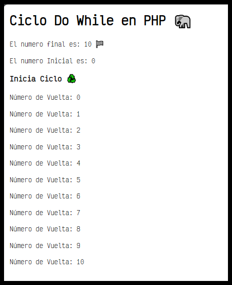
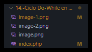

# 13.- Funciones Matemáticas en PHP🐘

<details>  <summary><h3> ¿Qué hace este programa? 🤔</h3> </summary>

## Funciones♻ en PHP

En PHP, El ciclo do-while en PHP funciona de la siguiente manera:

Primero, el bloque de código dentro del do se ejecuta al menos una vez, sin importar la condición.

Después de ejecutar el bloque de código dentro del do, se evalúa la condición del while.

Si la condición del while es verdadera, el ciclo se repite y vuelve a ejecutar el bloque de código dentro del do.

El ciclo continuará repitiéndose hasta que la condición del while sea falsa. Una vez que la condición es falsa, el ciclo do-while se detiene y el control pasa al código después del bloque do-while.

Es importante tener en cuenta que, debido a que el bloque de código se ejecuta al menos una vez antes de evaluar la condición, el ciclo do-while es útil cuando se desea que el bloque de código se ejecute al menos una vez, independientemente de si la condición es verdadera o falsa inicialmente. 🔄👨‍💻

### Funcionamiento

# Descripción del código en PHP con Ciclo Do While

Este código en PHP muestra el funcionamiento del ciclo `do-while`. A continuación se describe cada parte:

1. **Título y Mensajes Iniciales**:
   - Se muestra un título `Ciclo Do While en PHP 🐘` y mensajes iniciales utilizando `echo`.

2. **Inicialización de Variables**:
   - Se inicializan dos variables `$numeroinicial` y `$numerolimite` con valores `0` y `10` respectivamente.

3. **Mensajes de Información**:
   - Se muestran mensajes indicando el número final y el número inicial.

4. **Inicio del Ciclo**:
   - Se muestra un mensaje indicando el inicio del ciclo.

5. **Ciclo Do-While**:
   - Se inicia el ciclo `do-while`.
   - Dentro del ciclo, se muestra el número de vuelta actual.
   - La variable `$numeroinicial` se incrementa en `1` en cada iteración.
   - El ciclo continúa ejecutándose mientras `$numeroinicial` sea menor o igual que `$numerolimite`.

6. **Finalización del Ciclo**:
   - Una vez que `$numeroinicial` supera a `$numerolimite`, el ciclo se detiene.

Este código imprimirá los números del `0` al `10`, mostrando el número de vuelta en cada iteración, y luego detendrá la ejecución del ciclo. 🔄👨‍💻



</details>

## Information 🗂

- Title:  `Ciclo Do-While en PHP 🐘`
- Recreación de código por:
  - `Jorge A. Fuentes Jiménez` 👨‍💻 [@Lechu.Dev](https://github.com/LechugasJorge)

## Install & Dependence

- [](https://httpd.apache.org/)
- [](https://www.php.net/)
- [](https://code.visualstudio.com/)

<details>
  <summary>
  <h2> Código 👨‍💻 </h2>
  </summary>

```php
<?php
echo "<h1>Ciclo For en PHP 🐘</h1>";
for($numeroInicial=0;$numeroInicial<10;$numeroInicial++){
    echo "<br>Numero de vuelta ♻ ".$numeroInicial;
}
?>
```

Se puede copiar y pegar

</details>
<details>
  <summary>

## Uso

  ¡Experimenta con el código y aprende!

</summary>

1. Descarga y guarda el código PHP en un archivo con extensión `.php`, por ejemplo, `mi_pagina.php`.

2. Coloca este archivo en el directorio raíz de tu servidor web local (por ejemplo, en la carpeta `httdocs` si estás utilizando Apache).

3. Abre un navegador web y navega a la dirección donde has alojado el archivo, por ejemplo, `http://localhost/mi_pagina.php`.

4. Verás la página web generada por el script PHP, que incluirá un título, un subtítulo y un párrafo con mensajes estáticos.

5. ¡Experimenta modificando el código PHP y observa cómo afecta el resultado en la página web!

</details>

## 🟢 Jerarquía de Directorios



## Mi Equipo de Computo 🖥

- Software 👾

  ```txt
  OS: Windows 10 Pro for Workstations
  Sistema operativo de 64 bits
  PHP: PHP 8.2.12 (cli)
  Server version: Apache/2.4.58 (Win64)
  ```

- Hardware 🖥

```txt
  CPU: Intel(R) Core(TM) i3-7100U CPU @ 2.40GHz   2.40 GHz
  GPU: Intel(R) HD Graphics 620
```

## References

Obtenido de;

`CURSO php desde cero`

 [](https://www.youtube.com/watch?v=nCB1gEkRZ1g)

Muchas Gracias al canal

- [@Develoteca - Oscar Uh](https://www.youtube.com/@Develoteca)

<!-- Redes Sociales -->
<h2 align="center">Conécta conmigo</h2>
<p align="center">
  <a href="https://www.linkedin.com/in/jorgelechugas/">
    </a>
<!-- Twitter -->
<a href="https://twitter.com/Lechu_Dev">
  </a>
  <!-- Twitch -->
  <a href="https://www.twitch.tv/lechugaslettuches">
    
  </a>
</p><p align="center">
  <!-- YouTube -->
  <a href="https://www.youtube.com/channel/UCCVH3mvZFNs9vZQP_3PL_jw">
    
  </a>
<a href="https://www.youtube.com/channel/UCA-UArQPMiba7YgPw7OsgHg">
    
  </a>
</p><p align="center">
<!-- GitHub -->
<a href="https://github.com/usuario">
  
</a>
  <!-- Facebook -->
  <a href="https://www.facebook.com/profile.php?id=61550480867105">
    
  </a>
  <!-- Instagram -->
  <a href="https://www.instagram.com/lechugasskate/">
    
  </a>

</p>
<style>
  /* Estilos para la animación */
  details {
    background-color: #222222;
    padding: 10px;
    border: 1px solid #454545;
    border-radius: 5px;
    margin-bottom: 10px;
    overflow: hidden;
    transition: max-height 0.3s ease-out;
  }
  summary {
    cursor: pointer;
    user-select: none; /* Evitar la selección de texto */
    transition: color 0.3s ease-out;
  }
  summary:hover {
    color: #007bff; /* Cambiar color al pasar el mouse */
  }
</style>
