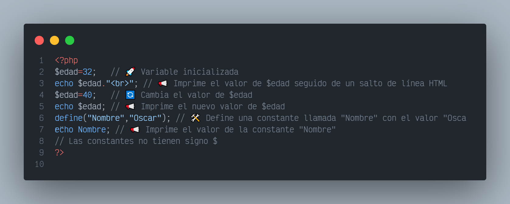
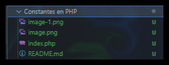

# 6.- Constantes en PHP  🐘

<details>  <summary><h3> ¿Qué hace este programa? 🤔</h3> </summary>
  <p>
    En este código PHP podemos obervar la diferencia entre variables y constantes en PHP, y cómo se accede a ellas en el código.
  </p>

  <p>
  
Una constante es un valor que no puede ser alterado o cambiado durante la ejecución de un programa. En PHP, una constante se define utilizando la función define() y se le asigna un nombre y un valor.

Las constantes son útiles cuando necesitas definir valores que permanecerán constantes a lo largo de la ejecución de tu programa, como por ejemplo, el nombre de una empresa, el valor de PI (π).

Algunas características importantes de las constantes en PHP son:

No necesitan el signo $ antes del nombre, a diferencia de las variables.
Una vez definidas, no se puede cambiar su valor durante la ejecución del script.
Las constantes son sensibles a mayúsculas y minúsculas por defecto, es decir, el nombre de una constante se debe escribir exactamente igual cada vez que se hace referencia a ella en el código.
  </p>



</details>

## Information 🗂

- Title:  `Constantes en PHP 🐘`
- Recreación de código por:
  - `Jorge A. Fuentes Jiménez` 👨‍💻 [@Lechu-Dev](https://github.com/LechugasJorge)

## Install & Dependence

- [](https://httpd.apache.org/)
- [](https://www.php.net/)
- [](https://code.visualstudio.com/)

<details>
  <summary>
  <h2> Código 👨‍💻 </h2>
  </summary>

```php
<?php
$edad=32;   // 🚀 Variable inicializada
echo $edad."<br>"; // 📢 Imprime el valor de $edad seguido de un salto de línea HTML
$edad=40;   // 🔄 Cambia el valor de $edad
echo $edad; // 📢 Imprime el nuevo valor de $edad
define("Nombre","Oscar"); // 🛠 Define una constante llamada "Nombre" con el valor "Oscar"
echo Nombre; // 📢 Imprime el valor de la constante "Nombre"
// Las constantes no tienen signo $
?>
```

Se puede copiar y pegar

</details>
<details>
  <summary>

## Uso

  ¡Experimenta con el código y aprende!

</summary>

1. Descarga y guarda el código PHP en un archivo con extensión `.php`, por ejemplo, `mi_pagina.php`.

2. Coloca este archivo en el directorio raíz de tu servidor web local (por ejemplo, en la carpeta `htdocs` si estás utilizando Apache).

3. Abre un navegador web y navega a la dirección donde has alojado el archivo, por ejemplo, `http://localhost/mi_pagina.php`.

4. Verás la página web generada por el script PHP, que incluirá un título, un subtítulo y un párrafo con mensajes estáticos.

5. ¡Experimenta modificando el código PHP y observa cómo afecta el resultado en la página web!

</details>

## 🟢 Jerarquía de Directorios



## Mi Equipo de Computo 🖥

- Software 👾

  ```txt
  OS: Windows 10 Pro for Workstations
  Sistema operativo de 64 bits
  PHP: PHP 8.2.12 (cli)
  Server version: Apache/2.4.58 (Win64)
  ```

- Hardware 🖥

```txt
  CPU: Intel(R) Core(TM) i3-7100U CPU @ 2.40GHz   2.40 GHz
  GPU: Intel(R) HD Graphics 620
```

## References

Obtenido de;

`CURSO php desde cero`

 [](https://www.youtube.com/watch?v=nCB1gEkRZ1g)

Muchas Gracias al canal

- [@Develoteca - Oscar Uh](https://www.youtube.com/@Develoteca)

<!-- Redes Sociales -->
<h2 align="center">Conécta conmigo</h2>
<p align="center">
  <a href="https://www.linkedin.com/in/jorgelechugas/">
    </a>
<!-- Twitter -->
<a href="https://twitter.com/Lechu_Dev">
  </a>
  <!-- Twitch -->
  <a href="https://www.twitch.tv/lechugaslettuches">
    
  </a>
</p><p align="center">
  <!-- YouTube -->
  <a href="https://www.youtube.com/channel/UCCVH3mvZFNs9vZQP_3PL_jw">
    
  </a>
<a href="https://www.youtube.com/channel/UCA-UArQPMiba7YgPw7OsgHg">
    
  </a>
</p><p align="center">
<!-- GitHub -->
<a href="https://github.com/usuario">
  
</a>
  <!-- Facebook -->
  <a href="https://www.facebook.com/profile.php?id=61550480867105">
    
  </a>
  <!-- Instagram -->
  <a href="https://www.instagram.com/lechugasskate/">
    
  </a>

</p>
<style>
  /* Estilos para la animación */
  details {
    background-color: #222222;
    padding: 10px;
    border: 1px solid #454545;
    border-radius: 5px;
    margin-bottom: 10px;
    overflow: hidden;
    transition: max-height 0.3s ease-out;
  }
  summary {
    cursor: pointer;
    user-select: none; /* Evitar la selección de texto */
    transition: color 0.3s ease-out;
  }
  summary:hover {
    color: #007bff; /* Cambiar color al pasar el mouse */
  }
</style>
