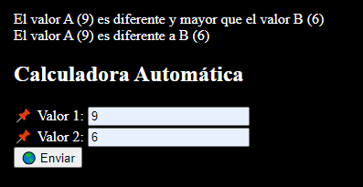
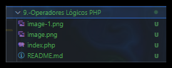

# 9.- Operadores Lógicos PHP  🐘

<details>  <summary><h3> ¿Qué hace este programa? 🤔</h3> </summary>
  <p>
Este programa es útil para comprender cómo funcionan los operadores lógicos en PHP y cómo se pueden utilizar para tomar decisiones en nuestros programas.Demuestra el uso de operadores lógicos y relacionales para comparar dos valores ingresados por el usuario y mostrar mensajes descriptivos según las condiciones evaluadas.

  </p>

## Operadores Lógicos en PHP

Los operadores lógicos en PHP son herramientas que permiten combinar o comparar expresiones booleanas para tomar decisiones en nuestros programas. Estos operadores nos ayudan a controlar el flujo de ejecución del código, permitiendo realizar acciones basadas en condiciones lógicas.

### Tipos de Operadores Lógicos

1. **AND (`&&` o `and`):** Devuelve `true` si ambas expresiones son verdaderas.
2. **OR (`||` o `or`):** Devuelve `true` si al menos una de las expresiones es verdadera.
3. **XOR (`xor`):** Devuelve `true` si solo una de las expresiones es verdadera, pero no ambas.
4. **NOT (`!`):** Niega una expresión booleana. Si la expresión es verdadera, devuelve `false`, y viceversa.



</details>

## Information 🗂

- Title:  `Operadores Lógicos PHP 🐘`
- Recreación de código por:
  - `Jorge A. Fuentes Jiménez` 👨‍💻 [@Lechu-Dev](https://github.com/LechugasJorge)

## Install & Dependence

- [](https://httpd.apache.org/)
- [](https://www.php.net/)
- [](https://code.visualstudio.com/)

<details>
  <summary>
  <h2> Código 👨‍💻 </h2>
  </summary>

```php
<?php
    # Operadores Lógicos o Booleanos
if ($_POST) {
    $valorA = $_POST['Valor1'];
    $valorB = $_POST['Valor2'];
    
    if (($valorA != $valorB) && ($valorA > $valorB)) {
        echo "El valor A ($valorA) es diferente y mayor que el valor B ($valorB)<br>";
    }
    if (($valorA == $valorB) || ($valorA < $valorB)) {
        echo "El valor A ($valorA) es igual o menor que el valor B ($valorB)<br>";
    }
    if ($valorA xor $valorB) {
        echo "Uno y solo uno de los valores A y B es verdadero<br>";
    }
    if (!($valorA == $valorB)) {
        echo "El valor A ($valorA) es diferente a B ($valorB)<br>";
    }
}           // Mas operadores Lógicos: and &&, or ||, xor !,
?>

<!DOCTYPE html>
<html lang="en">
<head>
    <meta charset="UTF-8">
    <meta name="viewport" content="width=device-width, initial-scale=1.0">
    <title>Document</title>
</head>
<body style="background-color: black; color: white;">
<h2>Calculadora Automática</h2>
    <!--Cuando no se pone Action el formulario se mantiene enel mismo fichero-->
    <form action="" method="post">
        <label for="v1">📌 Valor 1: </label>
<input type="text" name="Valor1" id="v1" placeholder="Ingresa el valor 1 🖋"><br>
        <label for="v2">📌 Valor 2: </label>
<input type="text" name="Valor2" id="v2" placeholder="Ingresa el valor 2 🖋"><br>
         <input type="submit" value="🌎 Enviar">
    </form>
</body>
</html>
```

Se puede copiar y pegar

</details>
<details>
  <summary>

## Uso

  ¡Experimenta con el código y aprende!

</summary>

1. Descarga y guarda el código PHP en un archivo con extensión `.php`, por ejemplo, `mi_pagina.php`.

2. Coloca este archivo en el directorio raíz de tu servidor web local (por ejemplo, en la carpeta `htdocs` si estás utilizando Apache).

3. Abre un navegador web y navega a la dirección donde has alojado el archivo, por ejemplo, `http://localhost/mi_pagina.php`.

4. Verás la página web generada por el script PHP, que incluirá un título, un subtítulo y un párrafo con mensajes estáticos.

5. ¡Experimenta modificando el código PHP y observa cómo afecta el resultado en la página web!

</details>

## 🟢 Jerarquía de Directorios



## Mi Equipo de Computo 🖥

- Software 👾

  ```txt
  OS: Windows 10 Pro for Workstations
  Sistema operativo de 64 bits
  PHP: PHP 8.2.12 (cli)
  Server version: Apache/2.4.58 (Win64)
  ```

- Hardware 🖥

```txt
  CPU: Intel(R) Core(TM) i3-7100U CPU @ 2.40GHz   2.40 GHz
  GPU: Intel(R) HD Graphics 620
```

## References

Obtenido de;

`CURSO php desde cero`

 [](https://www.youtube.com/watch?v=nCB1gEkRZ1g)

Muchas Gracias al canal

- [@Develoteca - Oscar Uh](https://www.youtube.com/@Develoteca)

<!-- Redes Sociales -->
<h2 align="center">Conécta conmigo</h2>
<p align="center">
  <a href="https://www.linkedin.com/in/jorgelechugas/">
    </a>
<!-- Twitter -->
<a href="https://twitter.com/Lechu_Dev">
  </a>
  <!-- Twitch -->
  <a href="https://www.twitch.tv/lechugaslettuches">
    
  </a>
</p><p align="center">
  <!-- YouTube -->
  <a href="https://www.youtube.com/channel/UCCVH3mvZFNs9vZQP_3PL_jw">
    
  </a>
<a href="https://www.youtube.com/channel/UCA-UArQPMiba7YgPw7OsgHg">
    
  </a>
</p><p align="center">
<!-- GitHub -->
<a href="https://github.com/usuario">
  
</a>
  <!-- Facebook -->
  <a href="https://www.facebook.com/profile.php?id=61550480867105">
    
  </a>
  <!-- Instagram -->
  <a href="https://www.instagram.com/lechugasskate/">
    
  </a>

</p>
<style>
  /* Estilos para la animación */
  details {
    background-color: #222222;
    padding: 10px;
    border: 1px solid #454545;
    border-radius: 5px;
    margin-bottom: 10px;
    overflow: hidden;
    transition: max-height 0.3s ease-out;
  }
  summary {
    cursor: pointer;
    user-select: none; /* Evitar la selección de texto */
    transition: color 0.3s ease-out;
  }
  summary:hover {
    color: #007bff; /* Cambiar color al pasar el mouse */
  }
</style>
