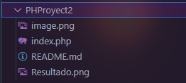

# PHProyect 2


<details>
  <summary>¿Qué hace este programa?</summary>
  <p>
    Este código en PHP se encarga de recibir información de un formulario utilizando el método POST. Si se envían datos mediante el formulario, se recoge la respuesta a la pregunta1 y se muestra un saludo personalizado en un encabezado h1.
  </p>
</details>

## Information

- Title:  `PHProyect 2`
- Authors:  `Jorge Lechu-Dev`

## Install & Dependence

- Apache
- PHP

<details>
  <summary>
  <h2> Código 👨‍💻 </h2>
  </summary>

```php
<!-- Método _POST -->
<?php
// Comprobamos si se han enviado datos mediante el método POST
if ($_POST) {
    // Si hay datos recibidos, almacenamos la respuesta a la pregunta1 en la variable $respuesta1
    $respuesta1 = $_POST['pregunta1'];
    // Mostramos un saludo personalizado utilizando la respuesta recibida
    echo "<h1>¡¡Hola ".$respuesta1."!! 🧟‍♂️ </h1>";
}
?>
<!-- Este es mi HTML normal. Desde aquí creamos un formulario y enviamos las respuestas a través del método post -->
<!DOCTYPE html>
<html lang="en">
<head>
    <meta charset="UTF-8">
    <meta name="viewport" content="width=device-width, initial-scale=1.0">
    <title>PHProject2</title>
</head>
<body style="background-color: black; color: white; ">
    <p>Este es mi primer ☝ Formulario 👨‍💻</p>
    <h2>Con uso de PHP 🐘</h2>
    <!-- Formulario -->
    <form action="index.php" method="POST">
        <label for="p1">🕵️‍♂️ Nombre:</label>
        <input type="text" id="p1" name="pregunta1" placeholder="Escribe tu nombre 🖋"><br>
        <input type="submit" value="🌎 Enviar">
    </form>
</body>
</html>
```

</details>

## Uso

1. Guarda el código PHP en un archivo con extensión `.php`, por ejemplo, `mi_pagina.php`.

2. Coloca este archivo en el directorio raíz de tu servidor web local (por ejemplo, en la carpeta `htdocs` si estás utilizando Apache).

3. Abre un navegador web y navega a la dirección donde has alojado el archivo, por ejemplo, `http://localhost/mi_pagina.php`.

4. Verás la página web generada por el script PHP.

5. ¡Experimenta modificando el código PHP y observa cómo afecta el resultado en la página web!

## Herarquia de Directorios



## Code Details

### Tested Platform

- Software

  ```txt
  OS: Windows 10 Pro for Workstations
  Sistema operativo de 64 bits
  PHP: PHP 8.2.12 (cli)
  Server version: Apache/2.4.58 (Win64)
  ```

- Hardware

```txt
  CPU: Intel(R) Core(TM) i3-7100U CPU @ 2.40GHz   2.40 GHz
  GPU: Intel(R) HD Graphics 620
```

## References

Obtenido de este curso;

 [](https://www.youtube.com/watch?v=nCB1gEkRZ1g)

<!-- Redes Sociales -->
<h2 align="center">Conéctate conmigo</h2>
<p align="center">
  
  <a href="https://www.linkedin.com/in/jorgelechugas/">
    
</a>
<!-- Twitter -->
<a href="https://twitter.com/Lechu_Dev">
  
</a>
  <!-- Twitch -->
  <a href="https://www.twitch.tv/lechugaslettuches">
    
  </a>

  <!-- YouTube -->
  <a href="https://www.youtube.com/channel/UCCVH3mvZFNs9vZQP_3PL_jw">
    
  </a>
<a href="https://www.youtube.com/channel/UCA-UArQPMiba7YgPw7OsgHg">
    
  </a>

<!-- GitHub -->
<a href="https://github.com/usuario">
  
</a>

  <!-- Facebook -->
  <a href="https://www.facebook.com/profile.php?id=61550480867105">
    
  </a>
  <!-- Instagram -->
  <a href="https://www.instagram.com/lechugasskate/">
    
  </a>

</p>
