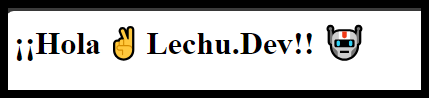
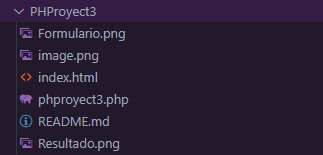

# PHProyect 3

<details>
  <summary>¿Qué hace este programa?</summary>
  <p>
    Este código PHP verifica si se han enviado datos mediante el método GET. Si se han enviado datos, recoge la respuesta a 'p1' y muestra un saludo personalizado en un encabezado h1.
  </p>




</details>

## Information

- Title:  `PHProyect 3`
- Authors:  `Jorge Lechu-Dev`

## Install & Dependence

- Apache
- PHP

<details>
  <summary>
  <h2> Código 👨‍💻 </h2>
  </summary>

```php
<?php
// Comprobamos si se han enviado datos mediante el método GET
if ($_GET) {
    // Si hay datos recibidos, almacenamos la respuesta a 'p1' en la variable $r1
    $r1 = $_GET['p1'];
    
    // Mostramos un saludo personalizado utilizando la respuesta recibida
    echo "<h1>¡¡Hola ✌ ".$r1."!! 🤖</h1>";
}
?>
```

</details>

## Uso

1. Guarda el código PHP en un archivo con extensión `.php`, por ejemplo, `mi_pagina.php`.

2. Coloca este archivo en el directorio raíz de tu servidor web local (por ejemplo, en la carpeta `htdocs` si estás utilizando Apache).

3. Abre un navegador web y navega a la dirección donde has alojado el archivo, por ejemplo, `http://localhost/mi_pagina.php`.

4. Verás la página web generada por el script PHP, que incluirá un título, un subtítulo y un párrafo con mensajes estáticos.

5. ¡Experimenta modificando el código PHP y observa cómo afecta el resultado en la página web!

## Herarquia de Directorios



## Code Details

### Tested Platform

- Software

  ```txt
  OS: Windows 10 Pro for Workstations
  Sistema operativo de 64 bits
  PHP: PHP 8.2.12 (cli)
  Server version: Apache/2.4.58 (Win64)
  ```

- Hardware

```txt
  CPU: Intel(R) Core(TM) i3-7100U CPU @ 2.40GHz   2.40 GHz
  GPU: Intel(R) HD Graphics 620
```

## References

Obtenido de este curso;

 [](https://www.youtube.com/watch?v=nCB1gEkRZ1g)

<!-- Redes Sociales -->
<h2 align="center">Conéctate conmigo</h2>
<p align="center">
  
  <a href="https://www.linkedin.com/in/jorgelechugas/">
    
</a>
<!-- Twitter -->
<a href="https://twitter.com/Lechu_Dev">
  
</a>
  <!-- Twitch -->
  <a href="https://www.twitch.tv/lechugaslettuches">
    
  </a>

  <!-- YouTube -->
  <a href="https://www.youtube.com/channel/UCCVH3mvZFNs9vZQP_3PL_jw">
    
  </a>
<a href="https://www.youtube.com/channel/UCA-UArQPMiba7YgPw7OsgHg">
    
  </a>

<!-- GitHub -->
<a href="https://github.com/usuario">
  
</a>

  <!-- Facebook -->
  <a href="https://www.facebook.com/profile.php?id=61550480867105">
    
  </a>
  <!-- Instagram -->
  <a href="https://www.instagram.com/lechugasskate/">
    
  </a>

</p>
